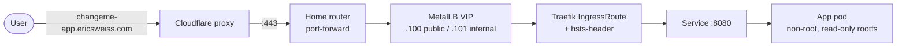
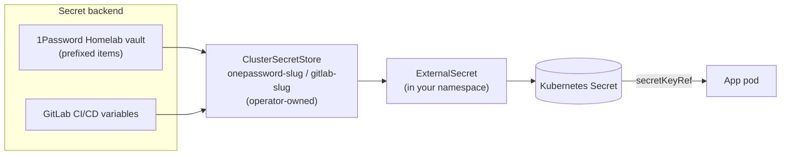

# Architecture — how a tenant app rides the weisssrv platform

This repo contributes **one namespace** of workloads to the weisssrv k3s
cluster. The platform (Traefik, cert-manager, external-dns, External Secrets
Operator, Prometheus/Loki, MetalLB) is shared; your repo supplies the app and
its per-namespace CRs. Flux reconciles this repo's `kubernetes/flux/` directory
into your namespace.

## Request path (public route)

- **Public** `*.ericsweiss.com`: the `IngressRoute` carries
  `external-dns.alpha.kubernetes.io/target: ericsweiss.com`; external-dns
  creates the proxied Cloudflare CNAME automatically. No operator action.
- **Internal** `*.esweiss.com` (opt-in): reached only on the LAN/tailnet via the
  `.101` VIP and the `lan-tailscale-only` middleware. The internal DNS name is
  **not** auto-provisioned — the operator adds an AdGuard rewrite.
- **TLS**: a per-host `Certificate` (ClusterIssuer `letsencrypt-prod`, DNS-01
  over Cloudflare) issues a secret into your namespace; Traefik terminates TLS
  from that secret. Per-host, not wildcard, to stay under Let's Encrypt's
  duplicate-certificate rate limit.

## Secret flow

- Secret **values** never enter git. This repo holds only the `ExternalSecret`
  manifest, which references the operator-provisioned `ClusterSecretStore`.
- 1Password items are **prefixed with your slug** in the shared Homelab vault
  (`remoteRef.key: "<slug>: <Item>"`, `remoteRef.property: <field>`), which
  isolates them from other tenants. GitLab CI/CD variables are the alternative
  backend for collaborators without vault access.

## Storage & scheduling

- The template app is **stateless** and soft-avoids the storage node. For
  persistent, zvol-backed data (e.g. a database), the operator provisions a zvol
  on `pve-nas-01` and a matching PV, and the pod is **pinned** to the NAS node
  with a required hostname affinity plus a toleration for
  `esweiss.com/nas=true:PreferNoSchedule`. NFS-backed config volumes mount **by
  hostname** `pve-nas-01.esweiss.com` with `xprtsec=tls`. Persistent storage is
  an operator-assisted step — see ONBOARDING.md.

## Autoscaling & resilience

- **VPA** (`updateMode: Initial`) right-sizes the pod on natural restarts.
- **HPA + PDB** are opt-in (`hpa.yaml`). Enabling the HPA means dropping the
  static `replicas` and making the VPA memory-only so the two never fight CPU.
- `kured` performs coordinated node reboots; a PDB keeps a replica up across
  drains.

## Observability

- **Metrics**: a `ServiceMonitor` is discovered cluster-wide by the platform
  Prometheus; the `NetworkPolicy` allows scrape from the `observability`
  namespace.
- **Alerts**: a `PrometheusRule` (down/stale) is likewise discovered
  cluster-wide and routed by the platform Alertmanager.
- **Logs**: container stdout/stderr ships to Loki via the Alloy DaemonSet
  automatically — nothing to configure.

## What the operator owns vs. what you own

| Owned by the operator (weisssrv repo) | Owned by you (this repo) |
|---|---|
| The `Namespace` (with PSA labels) | Everything under `kubernetes/flux/` |
| The `GitRepository` + `Kustomization` wiring | Workload, Service, routing CRs |
| The `ClusterSecretStore` + bootstrap secret | `ExternalSecret` references |
| Internal `*.esweiss.com` AdGuard rewrites | Public routing (external-dns) |
| Platform middlewares, ClusterIssuer, VIPs | Per-host `Certificate` |
| Persistent storage (zvol/PV) provisioning | PVC references (if any) |
